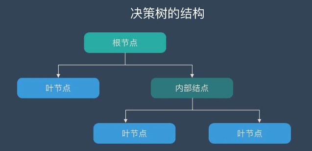
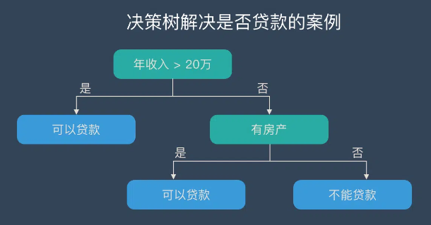
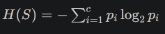
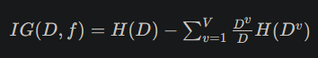
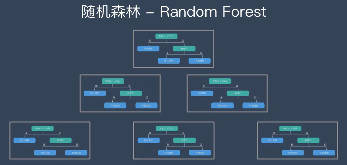

# 二分类之决策树与随机森林

[TOC]

## 一、决策树(Decision tree)

### **1. 什么是决策树？**

一种逻辑简单的树状结构的解决分类算法的算法。

### **2. 特点**

树状结构，结构简单，易于上手；
易于理解，符合人的直观思维，解释性强。

### **3. 结构**

由一个**根节点（输入样本全集）**发出，经过不断的 if-then-else 规则的**内部节点（特征属性测试）**进行有监督学习，最终达到**叶结点处（分类结果）**。

例如：根据**年收入**和**是否有房产**来判断**是否可贷款**

### **4. 建立决策树的三个要点**

#### (1)特征选择

决策树的内部结点是根据输入样本的不同特征来做判断，而特征选择则是决定使用哪种特征来做判断。

不同特征对分类结果的影响有大有小，特征选择是为了筛选出跟结果相关性更高的特征来做判断，即分类能力强的特征。

特征选择的准则：信息增益。

##### 信息增益的实现

1. 计算初始数据集的熵（entropy）

   熵是表示数据集无序程度的指标，其计算公式为：

   

   其中，*c* 为数据集中的类别数目，*p^i* 表示数据集中第 *i* 个类别的占比。

2. 针对每个特征，计算其对数据集划分后的信息增益（information gain）

   信息增益的计算公式为：
   
   

   其中，*D* 表示原始数据集，*f* 表示待选特征，*D^v* 表示由特征 *f* 在取值 *v* 时所得到的子数据集，*V* 表示特征 *f* 所有可能的取值。

   信息增益表示的是使用特征 *f* 进行数据集划分后，相对于使用其他特征进行划分而言，得到的整体信息增益量。

3. 对所有特征的信息增益进行比较，选取信息增益最大的特征作为当前节点的分裂特征

4. 将数据集按照选定的特征进行划分，并递归地构建子树，直到所有叶节点的类别均相同或者无法继续划分。

#### **(2)生成决策树**

从根节点出发，根据上面的方法计算信息增益，将选取到的一个特征作为一个内部节点的特征。以此类推，不断建立新的子节点，直到信息增益很小或没有特征可选择时为止。

#### (3)决策树剪枝

当决策树的子节点过多时，极易出现“过拟合”的现象，这是要主动给树“剪枝”，即去掉部分分支来抑制“过拟合”的现象。

### **5.几种典型的决策树**

#### (1). ID3算法：

即最早提出的决策树算法，利用信息增益来选择特征

#### (2). C4.5算法：

ID3的改进版，引入了“信息增益比”来作为特征选择的指标

##### **信息增益比**：

即**信息增益 / 划分信息**，其中划分信息反映了属性对于分类任务的**困难程度**，即样本在该属性上的**分布不确定性**的度量。使用信息增益比来选择最优划分属性，可以避免因为某些属性本身具有较高的熵而被选为划分属性的问题。

#### **(3).CART**

可用于**分类**和**回归**的决策树，使用**基尼系数**来代替信息熵模型。

##### 基尼系数

基尼系数（Gini index）是一个衡量样本**集合纯度**的指标，它表示从样本集合中随机抽取两个样本，其类别不一致的概率。对于一个有K个类别的分类问题，假设第k个类别的概率为pk，则样本集合的基尼系数可以计算为：Gini = 1 - Σ(pk^2)

### **6. 决策树的优缺点**

#### **优点**

- 决策树易于理解和解释，可以可视化分析，容易提取出规则；
- 可以同时处理标称型和数值型数据；
- 比较适合处理有缺失属性的样本；
- 能够处理不相关的特征；
- 测试数据集时，运行速度比较快；
- 在相对短的时间内能够对大型数据源做出可行且效果良好的结果。

#### **缺点**

- 容易发生过拟合（随机森林可以很大程度上减少过拟合）；
- 容易忽略数据集中属性的相互关联；
- 对于那些各类别样本数量不一致的数据，在决策树中，进行属性划分时，不同的判定准则会带来不同的属性选择倾向；信息增益准则对可取数目较多的属性有所偏好（典型代表ID3算法），而增益率准则（CART）则对可取数目较少的属性有所偏好，但CART进行属性划分时候不再简单地直接利用增益率尽心划分，而是采用一种启发式规则）（只要是使用了信息增益，都有这个缺点，如RF）。
- ID3算法计算信息增益时结果偏向数值比较多的特征。

## 二、随机森林(Random forest)

## 1. 什么是随机森林？

随机森林属于**集成学习**中的 Bagging（Bootstrap AGgregation 的简称）方法；

## 2. 结构

可以简单的理解为由很多“树”（决策树）集成的一座“森林”（随机森林）。不同的树之间，没有实际的关联。

## 3. 原理

进行分类任务时，每当新的输入样本进入，就让“森林”中的每一棵“树”分别进行判断和分类，每个决策树会得到一个自己的分类结果，分类结果中哪一个分类最多，那么随机森林就会把这个结果当做最终的结果。

## 4. 建立随机森林的步骤

### **(1).随机抽样**

将输入数据看作一个样本容量为N的样本，有放回的抽取N次，每次抽取1个，最终形成了N个样本。将这样选择的N个样本用来训练一个决策树，作为决策树根节点处的样本。

### **(2).随机选取属性**

若每个样本有M个属性，在决策树的每个节点分裂时，随机从这M个属性中选取出m个属性，满足条件m << M。然后从这m个属性中采用某种策略（比如说信息增益）来选择1个属性作为该节点的分裂属性。

### **(3).不断重复第(2)步**

决策树形成过程中每个节点都要按照步骤(2)来分裂（如果下一次该节点选出来的那一个属性是刚刚其父节点分裂时用过的属性，则该节点已经达到了叶子节点，无须继续分裂了）。一直到不能够再分裂为止。注意整个决策树形成过程中没有进行剪枝。

### **(4).不断重复上述步骤**

重复上述前三步，即重复建立决策树，最终形成随机森林。

## 5. 随机森林的优缺点

#### **优点**

1. 它可以出来很高维度（特征很多）的数据，并且不用降维，无需做特征选择
2. 它可以判断特征的重要程度
3. 可以判断出不同特征之间的相互影响
4. 不容易过拟合
5. 训练速度比较快，容易做成并行方法
6. 实现起来比较简单
7. 对于不平衡的数据集来说，它可以平衡误差。
8. 如果有很大一部分的特征遗失，仍可以维持准确度。

#### **缺点**

1. 随机森林已经被证明在某些噪音较大的分类或回归问题上会过拟合。
2. 对于有不同取值的属性的数据，取值划分较多的属性会对随机森林产生更大的影响，所以随机森林在这种数据上产出的属性权值是不可信的。

## 7. 四种随机森林的性能对比

随机森林是常用的机器学习算法，既可以用于分类问题，也可用于回归问题。本文对 scikit-learn、Spark MLlib、DolphinDB、XGBoost 四个平台的随机森林算法实现进行对比测试。评价指标包括内存占用、运行速度和分类准确性。

